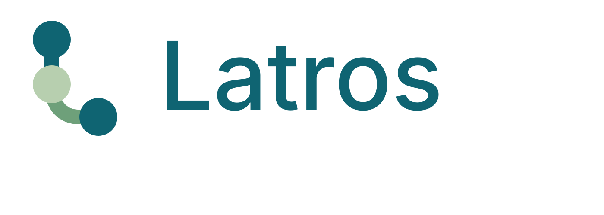

# Latros

<p align="center">
  
</p>

Prototype **interne de recherche** pour classer des maladies rares à partir de phénotypes HPO structurés. Moteur local et explicable, sans LLM, sans serveur et sans interface patient.

> **Aucun triage n'est effectué.** Toutes les analyses retournent `safety_status: not_evaluated`. Les scores sont des compatibilités sémantiques, jamais des probabilités ou des diagnostics validés. Ne pas utiliser ce prototype pour conseiller un patient.

La version `0.4.0` livre le Clinical Knowledge Model : contrats cliniques et de connaissances généraux, stratégies versionnées, couverture, abstention, sorties explicables et reçus reproductibles, tout en conservant le comportement v1. Voir le [journal des ADR](docs/decisions/README.md), la [méthodologie](docs/methodology.md) et [projet.md](projet.md).

Le [plan et son avancement](docs/plan.md) distingue fondation `v0.1.0`, premier snapshot médical `v0.2.0`, moteur pur `v0.3.0` et modèle général `v0.4.0`. Le snapshot de référence reste **`v0.2.0`** : v0.4 est une évolution logicielle et contractuelle, pas une nouvelle publication de données. [history.md](history.md) conserve les réalisations et vérifications datées.

> **Périmètre critique : maladies rares uniquement.** Le snapshot actuel ne couvre pas la médecine générale. Une plainte courante telle que fièvre et mal de gorge peut conduire à un classement de maladies rares hors périmètre ; ce classement ne doit pas être utilisé comme différentiel de médecine courante. L'extension est planifiée : [`v0.4 Clinical Knowledge Model`](docs/v0.4-clinical-knowledge-model.md) prépare l'architecture générale, puis `v0.5` devra intégrer une première extension étroite avec des sources auditées.

Les futurs snapshots multi-sources devront publier leur périmètre, leurs dépendances, leurs règles de déduplication et leurs profils de raisonnement compatibles. Le snapshot de connaissance et le profil d'agrégation seront versionnés séparément puis liés par leurs hashes dans chaque exécution ; `v0.2.0` reste immuable.

La trajectoire `v0.6` inclut explicitement les médicaments : exposition observée, substance active,
produit commercialisé, classe thérapeutique et assertions médicales sourcées resteront des objets
distincts. Cette préparation ne constitue ni une recommandation de traitement, ni une fonction de
prescription ; le détail est consigné dans le [cahier v0.4](docs/v0.4-clinical-knowledge-model.md).

`v0.5` est en cours sur une branche dédiée. Son premier checkpoint définit le registre et le
manifeste des futurs snapshots canoniques v2. Le travail technique utilise uniquement des fixtures
inventées ; la référence médicale reste `v0.2.0` et aucun manifeste `v0.5.0` n'existe tant que le
`NO-GO` SNOMED/HAS n'est pas levé.

`v0.4-D` fournit désormais le [schéma canonique v2](schemas/knowledge-model-v2.schema.json) et
la liste de ses [tables conceptuelles](schemas/canonical-tables-v2.json). L'adaptateur v1 est une
projection en lecture seule : il distingue enregistrements sources, assertions canoniques et
dérivations, conserve chaque provenance bilingue et ne transforme jamais un mapping en preuve
clinique. Les répétitions sémantiques restent auditables comme lignes sources mais partagent une
famille de preuve ; elles ne deviennent donc pas plusieurs confirmations indépendantes. Ces
contrats sont validés sur fixtures inventées et ne constituent pas un nouveau snapshot médical.

`v0.4-E` ajoute des interfaces séparées pour génération de candidats, scoring, questionnement et
explication, ainsi qu'un [profil `semantic_v1` hashé](profiles/semantic_v1.json). L'adaptateur v2
n'extrait que les observations HPO confirmées et actives ; les propositions et types non supportés
ne participent jamais au score. Le calcul historique n'a pas été déplacé : l'adaptateur appelle
toujours `Engine` et `question_v1`, dont les sorties v1 restent protégées par les tests d'or.

L'[audit des sources ORL de v0.5](docs/source-audits/v0.5-orl.md) conclut à un `NO-GO`
temporaire pour toute ingestion réelle : SNOMED France exige les licences adaptées et le modèle de
redistribution doit être clarifié ; la fiche HAS coélaborée avec des tiers exige une autorisation
écrite et une double revue clinique. Aucun dataset moins fiable ne la remplace automatiquement.

## Installation

Prérequis : Git, Python 3.11 et [uv](https://docs.astral.sh/uv/getting-started/installation/) (version utilisée en CI : `0.12.15`). L'installation initiale des dépendances et le téléchargement des sources nécessitent Internet. Ces commandes s'exécutent depuis la racine du dépôt sous PowerShell ou un shell Unix.

```text
git clone https://github.com/GaetanAff/Latros.git
cd Latros
uv sync --locked --python 3.11
uv run --no-sync latros --help
uv run --no-sync latros sources validate
```

Le dépôt est privé : Git doit disposer de votre authentification GitHub. `main` contient les jalons livrés v0.1 à v0.4, y compris le Clinical Knowledge Model et le logo officiel. `uv.lock` fixe les dépendances ; ne pas le mettre à jour pour reconstruire un snapshot historique. Pour récupérer les évolutions : `git pull --ff-only`, puis `uv sync --locked`.

## Télécharger les sources épinglées

Consulter les conditions de chaque produit dans [sources/registry.yaml](sources/registry.yaml). Une licence d'ontologie ne couvre pas nécessairement les annotations d'une autre source. HPOA et les annotations OMIM ne sont pas importées.

```text
uv run --no-sync latros sources list
uv run --no-sync latros sources fetch --source hpo --release 2026-09-01
uv run --no-sync latros sources fetch --source mondo --release 2026-09-01
uv run --no-sync latros sources fetch --source orphadata --release 2026-07
```

Le registre fournit versions, URLs officielles, produits, attributions, restrictions et SHA-256 attendus. Aucun lien `latest`. Les fichiers aboutissent à `data/raw/<source>/<release>/`, avec un manifeste local. Les fichiers complets déjà vérifiés sont réutilisés. Après interruption, relancer la commande : le fichier `.part` repart de zéro, sans retélécharger les autres fichiers valides. Un hash incorrect ou un fichier existant corrompu provoque un refus, sans écrasement du fichier complet.

| Source | Version | Utilisation |
| --- | --- | --- |
| [HPO](https://github.com/obophenotype/human-phenotype-ontology/releases/tag/v2026-09-01) | 2026-09-01 | Concepts, synonymes et hiérarchie HPO |
| [Mondo](https://github.com/monarch-initiative/mondo/releases/tag/v2026-09-01) | 2026-09-01 | Maladies, synonymes et mappings ORPHA |
| [Orphadata Science](https://sciences.orphadata.com/phenotypes/) | archive juillet 2026 | Associations maladie–HPO, fréquences et libellés EN/FR |

Les produits Orphadata sont fixés au commit `463f51d0db1d754b53e96027dd098a3d96a9c79c` de l'[archive officielle](https://github.com/Orphanet/Orphadata_aggregated/tree/463f51d0db1d754b53e96027dd098a3d96a9c79c). Date d'archive : 29 juin 2026 ; « juillet 2026 » est le nom de livraison du producteur.

## Construire et inspecter hors ligne

```text
uv run --offline --no-sync latros data build --snapshot v0.2.0
uv run --offline --no-sync latros data inspect --snapshot v0.2.0
```

Les sept tables canoniques sont publiées dans `data/canonical/v0.2.0/*.parquet`. Le runtime `data/runtime/v0.2.0/knowledge.duckdb` est ouvert en lecture seule par le moteur. Le [manifeste v0.2.0](manifests/v0.2.0.json) contient sources, hashes, comptes, version du code, transformations et avertissements. Cette référence reprend les mêmes données que l'ancien [latros-kb-0002](manifests/latros-kb-0002.json), conservé pour les reconstructions historiques. Le nouveau snapshot est construit séparément ; l'ancien manifeste n'est pas réécrit.

Un clone qui possède le manifeste mais pas les données reconstruit le snapshot et vérifie l'égalité du résultat. Aucun téléchargement pendant `build`. Un snapshot existant n'est jamais écrasé : un changement de sources ou d'implémentation nécessite un nouvel identifiant conforme au [plan](docs/plan.md), par exemple `v0.2.1` pour une révision de ce jalon. Un échec d'import produit un rapport local dans `data/failures/`, sans publier le snapshot.

L'étape 2 contient 60 928 concepts et 116 664 assertions maladie–phénotype. Le manifeste conserve 19 avertissements : un concept HPO inactif et 18 couples à fréquences contradictoires. Les règles de conservation et d'exclusion du calcul sont décrites ci-dessous et dans l'ADR.

Les hashes logiques portent sur les lignes triées et les hashes Parquet sur leurs fichiers : ils doivent être identiques à la reconstruction. Les octets du conteneur DuckDB peuvent différer malgré des données identiques ; son SHA-256 sert uniquement à détecter une corruption locale, dans `data/runtime/<snapshot>/integrity.json`, ignoré par Git. Le moteur vérifie ce reçu à chaque ouverture. Conserver le code et les dépendances verrouillées ; ne pas remplacer un manifeste historique pour masquer une dérive.

## Interroger le moteur

L'exemple est **inventé**, sans patient réel. La CLI attend des identifiants HPO, pas du texte libre.

```text
uv run --offline --no-sync latros diagnose --snapshot v0.2.0 --case examples/case.synthetic.json
uv run --offline --no-sync latros question next --snapshot v0.2.0 --case examples/case.synthetic.json
uv run --offline --no-sync latros diagnose --snapshot v0.2.0 --case examples/case.synthetic-v2.json
```

Format d'entrée :

```json
{
  "case_id": "experience-synthetique",
  "age": 22,
  "sex": "unknown",
  "observations": [
    {"concept_id": "HP:0001250", "status": "present"},
    {"concept_id": "HP:0000256", "status": "present"},
    {"concept_id": "HP:0001249", "status": "unknown"}
  ],
  "question_history": []
}
```

Ce JSON non versionné reste le contrat `ClinicalCaseV1`. Le nouveau schéma
[`ClinicalCaseV2`](schemas/clinical-case-v2.schema.json) est disponible pour préparer symptômes,
signes, temporalité, constantes, biologie, traitements, antécédents, risques, examens, imagerie et
contexte familial. Il porte obligatoirement `"schema_version": 2`, sépare les textes sources, les
propositions d'extraction et les observations confirmées, et ne contient aucune déduction du
moteur. La CLI accepte v1 et v2, mais ne transforme jamais silencieusement un fichier v1 : la
migration explicite reste disponible pour les appelants qui veulent conserver un cas v2.

`--strategy semantic_v1` est la stratégie par défaut. `--output-contract auto` conserve exactement
la sortie historique pour un cas v1 et retourne le nouveau contrat pour un cas v2. Les options
explicites `--output-contract v1` et `--output-contract v2` permettent de choisir le format. La
sortie v2 déclare périmètre, couverture, données utilisées ou ignorées, abstention, arguments par
source et famille de preuve, `safety.status: not_evaluated` et un reçu reproductible. Son agrégat
porte `scale_id: semantic_v1.compatibility` et n'est ni un pourcentage ni une probabilité.

Le reçu contient les hashes exacts du manifeste de connaissance et du profil de raisonnement, les
paramètres effectifs, sources et familles réellement utilisées, mappings, transformations et
version logicielle. Il est inclus dans le JSON de réponse mais n'est jamais persisté automatiquement.

Le résultat contient les 20 premiers candidats, rang, score brut, contributions favorables/défavorables, assertions sources, fréquences et informations encore inconnues. Les candidats gardent leurs identités ORPHA ; les équivalences Mondo explicites sont listées séparément. Âge et sexe sont conservés dans le contrat mais ignorés par le score.

Pour répondre, copier le cas dans `patient-data/` (ignoré par Git ; uniquement des cas synthétiques dans cette phase). Ajouter à `question_history` l'identifiant effectivement proposé et une réponse, par exemple :

```json
{"concept_id": "HP:0001252", "answer": "unknown"}
```

Relancer les commandes avec ce fichier. La CLI est sans session : l'appelant conserve l'historique, Latros ne modifie pas le cas. Si une observation du même concept existe, elle doit porter le même état. `unknown` ne change pas les scores mais empêche de reposer la question. Arrêt à 12 réponses ou sans question informative admissible. Sans signe présent exploitable : liste vide, pas de résultat rassurant.

Pour isoler les données : `latros --root <dossier> --registry <chemin-absolu-du-registre> ...`. Les options globales précèdent la sous-commande. `--case` est relatif au répertoire courant, pas à `--root`. JSON sur stdout ; erreurs sur stderr avec code de sortie non nul. Aucun cas ou résultat enregistré automatiquement. Attention aux redirections de sorties sensibles.

## Méthode et limites

Voir [les équations et règles détaillées](docs/methodology.md) : contenu informationnel du corpus, maximum de similarité Resnik par signe présent, moyenne positive et pénalités d'absence à fréquence connue. Aucun a priori épidémiologique, aucune prévalence, aucun posterior.

Les questions utilisent une réduction d'entropie **heuristique**, avec des poids internes dérivés des scores. Au moins 60 % du poids des dix premiers candidats doit disposer d'une fréquence pour le signe. Les fréquences manquantes ne deviennent jamais des absences.

L'import conserve et signale les fréquences contradictoires entre enregistrements distincts : elles ne servent ni aux pénalités ni aux questions. Un phénotype obsolète sans remplacement exact est conservé mais exclu du calcul. Les versions EN/FR d'un même enregistrement ne comptent qu'une fois. Les libellés HPO anglais présents dans le produit français restent identifiés comme anglais lorsqu'ils correspondent à un libellé anglais connu.

**Limites :** biais maladies rares et annotations, signes corrélés, temporalité/contexte non utilisés, questions techniques, aucune validation clinique. Les tests synthétiques vérifient le logiciel, pas sa justesse médicale. Aucun LLM, MedGemma, TxGemma, moteur de sécurité, audio, interface, entraînement ou conseil thérapeutique dans cette version.

## Développement et tests

```text
uv run --offline --no-sync ruff check .
uv run --offline --no-sync ruff format --check .
uv run --offline --no-sync mypy
uv run --offline --no-sync python scripts/export_schemas.py --check
uv run --offline --no-sync pytest
```

La CI Linux/Windows utilise uniquement les petits jeux inventés de `tests/conftest.py`, bloque le réseau pendant les tests et ne télécharge aucune base médicale. Les [schémas](schemas/) se régénèrent avec `python scripts/export_schemas.py` ; Pydantic vérifie en plus les contraintes inter-champs non exprimées en JSON Schema.

```text
src/latros/sources/     registre et téléchargement vérifié
src/latros/knowledge/   fréquences, importeurs, validation et snapshots
src/latros/clinical/    contrat ClinicalCase
src/latros/reasoning/   stratégies, profils, semantic_v1, sorties v2 et reçus
src/latros/cli.py       commandes publiques
sources/               registre épinglé (versionné)
schemas/               contrats exportés (versionnés)
profiles/              profils de raisonnement versionnés et hashés
manifests/             références de reconstruction (versionnées)
data/                  sources et snapshots locaux (ignorés)
tests/                 fixtures synthétiques et tests hors ligne
```

Suivre [CONTRIBUTING.md](CONTRIBUTING.md) : branches de fonctionnalité, pull requests et `main` stable. `0.4.0` reste un prototype de recherche, pas une certification médicale.

## Confidentialité et licences

Ne jamais envoyer sur GitHub les sources brutes, snapshots, données patient, poids de modèles ou secrets. Seuls code, documentation, registre, schémas, manifestes et fixtures inventées sont versionnés. `.gitignore` limite les accidents mais n'est pas un contrôle d'accès : vérifier chaque diff.

Attributions : Human Phenotype Ontology Consortium ; Mondo Disease Ontology contributors ; Orphadata, INSERM/Orphanet. Les licences des sources sont indépendantes de celle du code. Aucune licence de redistribution du code n'a encore été choisie ; le dépôt reste privé. La conservation locale d'une source ne dispense pas de respecter ses conditions.
